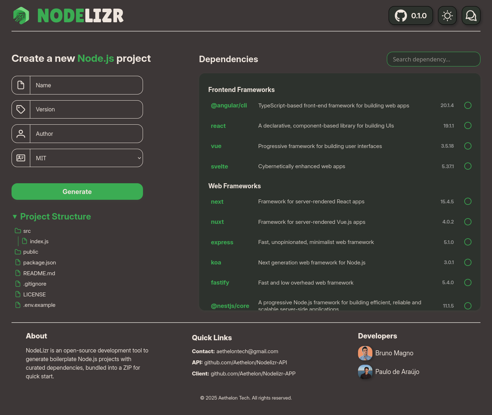
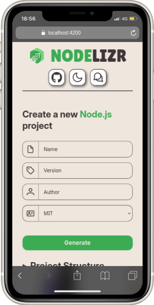

<div align="center">


# Nodelizr

[](./LICENSE)
[](https://github.com/Aethelon/Nodelizr/issues)
[](https://github.com/Aethelon/Nodelizr/commits/main)
[](https://nodelizr-api.vercel.app)

</div>

> **Nodelizr** is an open-source tool to instantly generate modern, ready-to-use Node.js project boilerplates with curated dependencies. Save time, standardize your stack, and start building faster.

</br>

## 🌐 Access Online

You can use Nodelizr directly in your browser, no installation required:

👉 **[nodelizr.vercel.app](https://nodelizr.vercel.app)**

</br>

## 📖 Table of Contents

- [Features](#-features)
- [Visuals](#-visuals)
- [Quickstart](#-quickstart)
- [Usage](#-usage)
- [Roadmap](#-roadmap)
- [FAQ](#-faq)
- [Support](#-support)
- [Contributing](#-contributing)
- [Resources](#-resources)
- [Authors & Acknowledgments](#-authors--acknowledgments)
- [License](#-license)
- [Project Status](#-project-status)
- [Show your support](#-show-your-support)

</br>

## 🚀 Features

- **Instant Node.js project generation**
- **Curated dependency selection** (choose your stack)
- **Modern, clean UI**
- **Download as ready-to-run ZIP**
- **Open source & community-driven**
- **Preview project structure before download**
- **Easy metadata input (name, author, version, etc.)**
- **Responsive design**

</br>

## 📸 Visuals

<details>
<summary>Desktop</summary>



</details>
<details>
<summary>Mobile</summary>



</details>
<details>
<summary>Tablet</summary>


</details>
</br>

## ⚡ Quickstart

1. **Clone the repository**
   ```bash
   git clone https://github.com/Aethelon/Nodelizr.git
   cd Nodelizr
   ```
2. **Install dependencies**
   ```bash
   npm install
   ```
3. **Start the development server**
   ```bash
   ng serve
   ```
4. Open [http://localhost:4200](http://localhost:4200) in your browser.

</br>

## 🛠️ Usage

1. **Fill in project metadata** (name, author, version)
2. **Select dependencies** from curated categories
3. **Preview project structure**
4. **Generate & download** your custom Node.js boilerplate as a ZIP

</br>

## 🗺️ Roadmap

- [ ] Add more dependency categories
- [ ] Support for custom templates
- [ ] Multi-language support
- [ ] Community-driven dependency suggestions

</br>

## ❓ FAQ

**Q: What is Nodelizr?**
A: An open-source tool to generate Node.js project boilerplates with curated dependencies.

**Q: Can I suggest new dependencies?**
A: Yes! Open an issue or pull request.

**Q: Is it free?**
A: 100% free and open source under the MIT License.

</br>

## 💬 Support

- [Open an issue](https://github.com/Aethelon/Nodelizr/issues)
- [Discussions](https://github.com/Aethelon/Nodelizr/discussions)
- Contact the authors
  - [Bruno Magno](https://github.com/brunoliratm)
  - [Paulo de Araujo](https://github.com/Paulo-Araujo-Jr)

</br>

## 🤝 Contributing

Contributions are welcome! To get started:

1. Fork this repo
2. Create a new branch (`git checkout -b feature/your-feature`)
3. Commit your changes
4. Open a Pull Request

For major changes, please open an issue first to discuss what you’d like to change.

</br>

## 📚 Resources

- [API Repository](https://github.com/Aethelon/Nodelizr-API)

</br>

## 👤 Authors & Acknowledgments

- [Bruno Magno](https://github.com/brunoliratm)
- [Paulo de Araújo](https://github.com/Paulo-Araujo-Jr)

</br>

## 📄 License

This project is licensed under the [MIT License](LICENSE).

</br>

## 📈 Project Status

NodelizrAPP is actively maintained. Feedback, issues, and feature requests are welcome!

</br>

## ⭐️ Show your support

If you like this project, please star the repo and share it with your friends!
